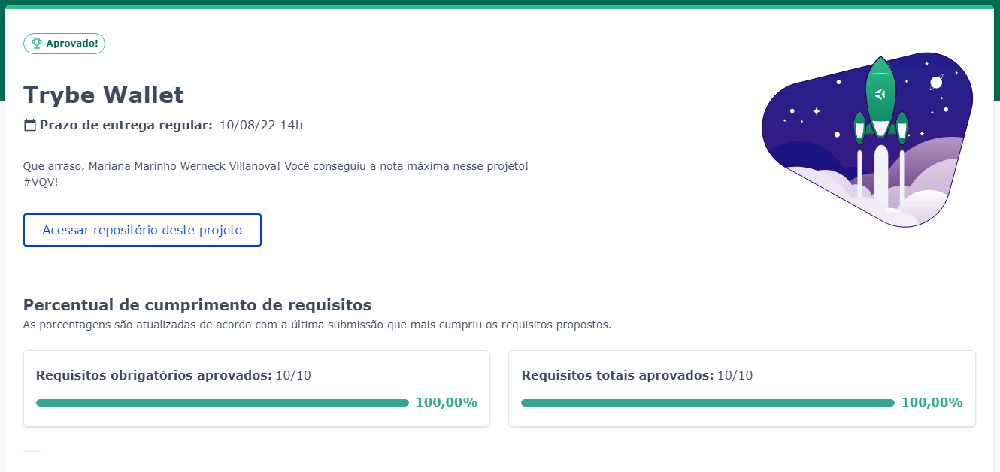
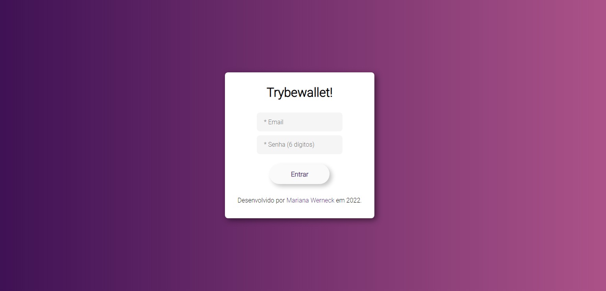
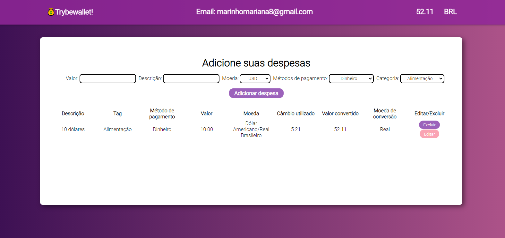

# Projeto Trybewallet!

Nesse projeto foi desenvolvido uma aplicação com React, Redux e React Testing Library, que computa gastos em diferentes moedas e converte para Real utilizando a API de [Cotação de Moedas](https://docs.awesomeapi.com.br/api-de-moedas)

## Desempenho:

O projeto Trybewallet foi desenvolvido por [Mariana Werneck](https://www.linkedin.com/in/marinhomariana8/) durante o curso de Desenvolvimento Web na [Trybe](https://www.betrybe.com/)! Foi adquirido 100% do projeto total.

## Preview: 

## Connect:

 